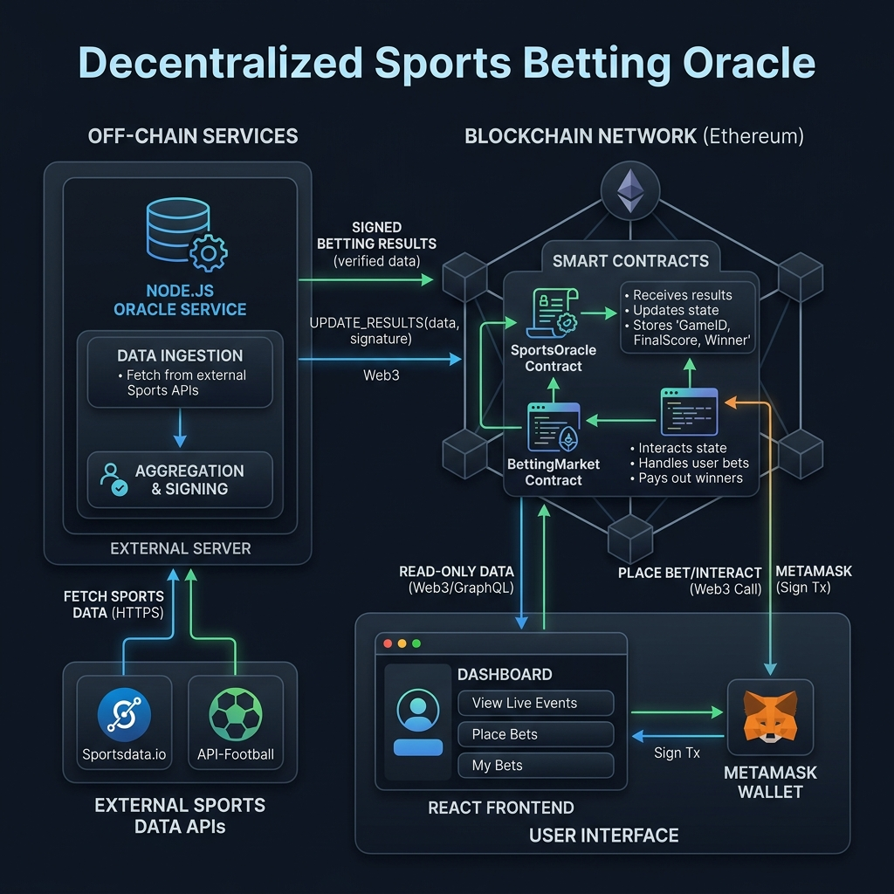

# DeFi Sports Betting Oracle System



## 📋 Overview
This project is a decentralized sports betting platform designed to solve the **"Oracle Problem"**—the inability of smart contracts to natively access off-chain data. It uses a custom Node.js service to bridge real-world sports scores from external APIs into the Ethereum blockchain.

### 🛡️ Why This Project?
- **Trustless Execution**: Bets are settled based on verifiable data stored in the `SportsOracle` contract.
- **Access Control**: Only the authorized Oracle service can submit match results, preventing manipulation.
- **Containerized Reliability**: The entire stack (Blockchain, Backend, Frontend) is orchestrated to ensure consistent environments across all machines.

---

## 🏗 System Architecture

The system consists of three modular layers:

### 1. Off-Chain Oracle (`oracle-service/`)
- **Engine**: Node.js & Express.
- **Role**: Fetches live data from **TheSportsDB API**, signs the payload with a private key, and calls the `submitPlayerData` function on-chain.
- **Features**: Includes manual override endpoints for simulation and testing.

### 2. On-Chain Smart Contracts (`blockchain/`)
- **SportsOracle.sol**: Acts as the data repository. It maintains a mapping of match results and player performances.
- **BettingMarket.sol**: The user-facing contract. It accepts ETH wagers, links to the oracle for truth, and handles automated 2x payouts to winners.
- **Tooling**: Built and tested using **Hardhat**.

### 3. Frontend Dashboard (`frontend/`)
- **Tech Stack**: React 18, Vite, Ethers.js.
- **User Flow**: Connect via MetaMask -> Select Match -> Place Wager -> Settle & Payout.
- **Testing**: Includes `data-test-id` attributes for automated QA.

---

## 🚀 Getting Started

### 1. Prerequisites
- [Docker Desktop](https://www.docker.com/)
- [MetaMask Browser Extension](https://metamask.io/)

### 2. Quick Launch
Run the following command in the project root:
```bash
docker compose up --build -d
```
This will:
- Start a local Hardhat node.
- Compile and deploy the smart contracts.
- Initialize the Oracle service.
- Serve the Frontend at `http://localhost:5173`.

### 3. Wallet Configuration
To interact with the app, configure MetaMask:
- **Network RPC**: `http://localhost:8545`
- **Chain ID**: `31337`
- **Imported Private Key**: `0xac0974bec39a17e36ba4a6b4d238ff944bacb478cbed5efcae784d7bf4f2ff80` (Standard Hardhat Account #0).

---

## 🛠 Manual API Triggers (Testing)

You can simulate match completion using the Oracle's API:

| Task | Endpoint | Sample Payload |
| :--- | :--- | :--- |
| **Update Score** | `POST /api/trigger-update` | `{"matchId": 1, "playerId": 101, "pointsScored": 30}` |
| **Finalize Game** | `POST /api/trigger-finalize` | `{"matchId": 1, "playerId": 101}` |

---

## 🔍 Troubleshooting & Reset

### Handling Nonce Issues (MetaMask)
If your transaction gets stuck or shows "Insufficient Funds" despite having 10,000 ETH:
1. Open MetaMask.
2. Go to **Settings** > **Advanced**.
3. Click **Clear activity tab data**.
4. This clears the cached transaction history from previous blockchain runs.

### Resetting the Stack
To start fresh:
```bash
docker compose down -v
docker compose up --build
```
The `-v` flag ensures all old volumes and states are cleared.

---

## 🧪 Testing & Coverage
Run the Solidity test suite to ensure 70%+ coverage:
```bash
cd blockchain
npx hardhat test
npx hardhat coverage
```
