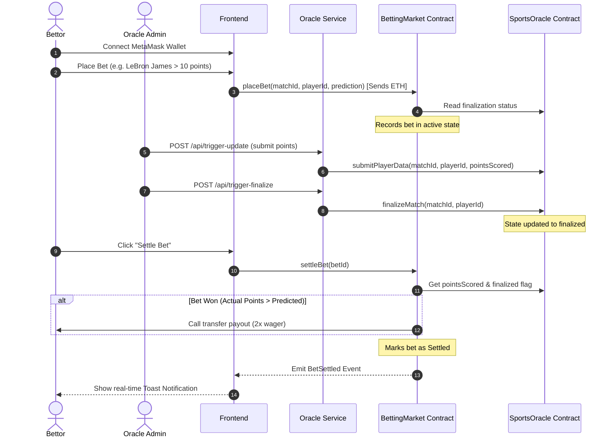

# 🏆 DeFi Sports Betting Oracle System

A premium, containerized full-stack decentralized application (dApp) featuring a custom blockchain oracle system, smart-contract-based wagering, and an event-driven React frontend.

---

## 🗺️ System Architecture

```mermaid
graph TD
    subgraph Client Layer
        Bettor[Bettor / User]
        Admin[Oracle Admin]
        UI[React dApp UI - Port 5173]
        Wallet[MetaMask Wallet]
        Events[Ethers.js Event Listeners]
    end

    subgraph Oracle Layer
        API[Node.js Express API - Port 3001]
        Val[Strict Input Validation]
        OracleWallet[Oracle Hot Wallet]
    end

    subgraph Smart Contract Layer [Hardhat Local - Port 8545]
        BM[BettingMarket.sol Contract]
        SO[SportsOracle.sol Contract]
    end

    %% Client Interactions
    Bettor -->|Connect| Wallet
    Bettor -->|Place Bet / Send ETH| BM
    
    %% Oracle Interactions
    Admin -->|POST /api/trigger-update| API
    Admin -->|POST /api/trigger-finalize| API
    API -->|Validate Types| Val
    Val -->|submitPlayerData()| SO
    Val -->|finalizeMatch()| SO
    OracleWallet -.->|Signs Transactions| SO

    %% Settlement
    Bettor -->|Settle Bet| BM
    BM -->|Verify Score & Status| SO
    BM -->|Transfer Payout| Bettor

    %% Event Updates
    BM -.->|Emits BetPlaced & BetSettled| Events
    Events -.->|React State Change| UI
```

The application consists of three containerized services coordinated seamlessly:
1. **Local Blockchain Nodes (Hardhat)**: Hosts the Solidity smart contracts (`SportsOracle.sol` and `BettingMarket.sol`).
2. **Off-Chain Oracle (Node.js)**: Validates input parameters and securely updates player performance metrics on-chain.
3. **dApp Frontend (React + Vite + Ethers.js)**: Provides an interactive interface featuring wallet connections, toast notifications, real-time transaction updates, and active bet settlement.

---

## 💡 The Problem Solved (The Blockchain Oracle Problem)

Blockchains are deterministic, isolated environments. A Solidity smart contract cannot fetch data from the outside world (like sports scores or stock prices) because nodes must reach consensus on every transaction execution. This isolation is known as the **Blockchain Oracle Problem**.

### Our Solution
This project implements an **off-chain Oracle Service**:
- **Trustworthy Feeds**: An off-chain Node.js service acts as the trusted bridge, fetching real-world data and pushing it onto the blockchain via the `submitPlayerData` and `finalizeMatch` contract functions.
- **Strict Access Control**: The `SportsOracle` contract restricts access to these data feeds using an `onlyOracle` modifier, ensuring that only the designated oracle address can write performance statistics.
- **Secure Settlements**: Once the match is finalized by the Oracle, the `BettingMarket` contract queries the oracle's state variables to securely verify outcomes and pay out wagers.

---

## 🛠️ Technology Stack

- **Smart Contracts**: Solidity v0.8.20, Hardhat (local node environment, Mocha/Chai tests)
- **Backend Oracle**: Node.js, Express, Ethers.js v6
- **Frontend dApp**: React (Vite), Ethers.js v6, Vanilla CSS (glassmorphic styling, responsive layout)
- **Containerization**: Docker, Docker Compose (configured with healthchecks and dependencies)

---

## ⚡ Step-by-Step Flow


```mermaid
sequenceDiagram
    autonumber
    actor Bettor
    actor Oracle Admin
    participant Frontend
    participant Oracle Service
    participant BettingMarket Contract
    participant SportsOracle Contract

    Bettor->>Frontend: Connect MetaMask Wallet
    Bettor->>Frontend: Place Bet (e.g. LeBron James > 10 points)
    Frontend->>BettingMarket Contract: placeBet(matchId, playerId, prediction) [Sends ETH]
    BettingMarket Contract->>SportsOracle Contract: Read finalization status
    Note over BettingMarket Contract: Records bet in active state

    Oracle Admin->>Oracle Service: POST /api/trigger-update (submit points)
    Oracle Service->>SportsOracle Contract: submitPlayerData(matchId, playerId, pointsScored)
    Oracle Admin->>Oracle Service: POST /api/trigger-finalize
    Oracle Service->>SportsOracle Contract: finalizeMatch(matchId, playerId)
    Note over SportsOracle Contract: State updated to finalized

    Bettor->>Frontend: Click "Settle Bet"
    Frontend->>BettingMarket Contract: settleBet(betId)
    BettingMarket Contract->>SportsOracle Contract: Get pointsScored & finalized flag
    alt Bet Won (Actual Points > Predicted)
        BettingMarket Contract->>Bettor: Call transfer payout (2x wager)
    end
    Note over BettingMarket Contract: Marks bet as Settled
    BettingMarket Contract-->>Frontend: Emit BetSettled Event
    Frontend-->>Bettor: Show real-time Toast Notification
```

---

## 🔒 Key Security Enhancements

1. **Modern Safe ETH Transfers**: Replaced Solidity's deprecated `.transfer()` (which has a rigid 2,300 gas limit) with a low-level `.call` pattern in `BettingMarket.sol` to protect against gas limit changes and prevent transaction reverts for multisig/smart wallets.
2. **Robust Input Validation**: The Node.js Oracle service employs strict parameter validation. Parameters (`matchId`, `playerId`, `pointsScored`) must be non-negative integers (`uint256` safe) and are strictly validated prior to submitting contract transactions.
3. **Event-Driven React UI**: The frontend avoids polling. Ethers.js listeners react to `BetPlaced` and `BetSettled` smart contract events to update the UI states immediately, creating a seamless and responsive dApp experience.

---

## 📦 Rapid Deployment

### Prerequisites
- Docker and Docker Compose
- MetaMask browser extension

### 1. Launch the Services
Start the entire stack in detached mode:
```bash
docker-compose up --build -d
```
Verify the health of all services (Hardhat, Oracle, and Frontend) using:
```bash
docker-compose ps
```
*All three services should achieve a `healthy` status.*

### 2. Configure MetaMask
Add the local Hardhat network to your wallet extension:
- **Network Name**: Hardhat Local
- **New RPC URL**: `http://localhost:8545`
- **Chain ID**: `31337`
- **Currency Symbol**: `ETH`

Import one of Hardhat's default test account private keys (e.g., `0xac0974bec39a17e36ba4a6b4d238ff944bacb478cbed5efcae784d7bf4f2ff80`) to interact with the dApp.

### 3. Access URLs
- **dApp UI**: [http://localhost:5173](http://localhost:5173)
- **Oracle Health**: [http://localhost:3001/health](http://localhost:3001/health)

---

## 🧪 Testing the Contracts

Run contract unit tests and check Solidity code coverage:
```bash
cd blockchain
npm install
npm test
npm run coverage
```
*The contracts maintain **100% test coverage** for all statements, branches, and functions.*

---

## 🐳 Docker Hub Images
Official prebuilt Docker images are maintained under the **SabbellaLaharika** namespace:
- `sabbellalaharika/defi-sports-oracle-hardhat`
- `sabbellalaharika/defi-sports-oracle-oracle`
- `sabbellalaharika/defi-sports-oracle-frontend`

---
MIT License - 2026

